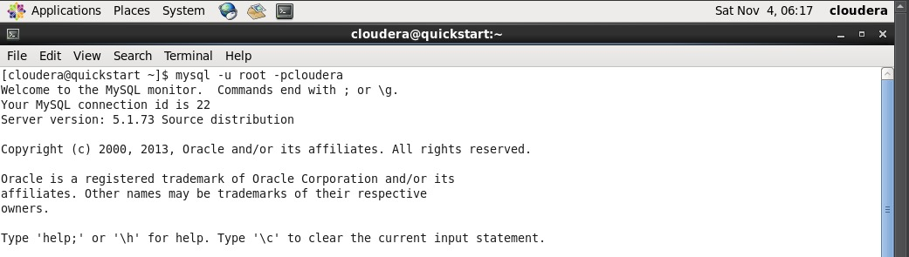

# Tugas2_BigData

## Big Data dengan Hadoop (Install Virtual Box & Cloudera Distribution)
- demo menggunakan virtual box dan cloudera quickstart vm. dengan database yang sudah ada di mysql, untuk masuk ke terminal di cloudera masukan syntax berikut 

- database yang digunakan adalah retail_db, periksa tabel di dalam, dengan masukkan perintah berikut
use retail_db;
show tables;

- Sekarang gunakan tabel "departments" dari database "retail_db". Untuk itu, harus mengetikkan perintah berikut

select*from departemens;

- Setelah itu, buka terminal lain di Cloudera dan ketik yang berikut ini:

hostname -f //Checks the hostname
sqoop list-databases --connect jdbc:mysql://localhost/ --password cloudera --username root; //Lists the databases using Sqoop

- untuk membuat daftar tabel yang ada di retail_db menggunakan Sqoop, ketik perintah berikut:
sqoop list-tables --connect jdbc:mysql://quickstart:3306/retail_db --password cloudera --username root; //Lists the tables present in retail_db using Sqoop

-  agar terhubung ke database MySQL dan mengimpor database pelanggan ke HDFS. Mari kita lanjutkan dan jalankan perintah impor pertama kita:

sqoop import --connect jdbc:mysql://quickstart:3306/retail_db --password cloudera --username root --table departments; //Executes Map Tasks at the back end

- Setelah kode dieksekusi, kami dapat periksa UI web HDFS menggunakan localhost: 50075, tempat data diimpor. Sekarang, dapat kembali ke jendela terminal dan mengetikkan yang berikut ini: 

hadoop fs -ls /user/cloudera //Checks if importing data into HDFS was successful
hadoop fs -cat /user/cloudera/departments/part*  //Views the contents of the department table

- beralih ke data filter sekarang; kami dapat menggunakan perintah impor berikut untuk memfilter baris tertentu dengan menggunakan klausa where:

sqoop import -–connect jdbc:mysql://quickstart:3306/retail_db --password cloudera --username root --table departments –-m 3 --where “department_id>4” --target-dir /user/cloudera/dept2;

lihat isi direktori dept2, dan untuk itu, harus mengetikkan perintah berikut:
hadoop fs -cat /user/cloudera/dept2/part*